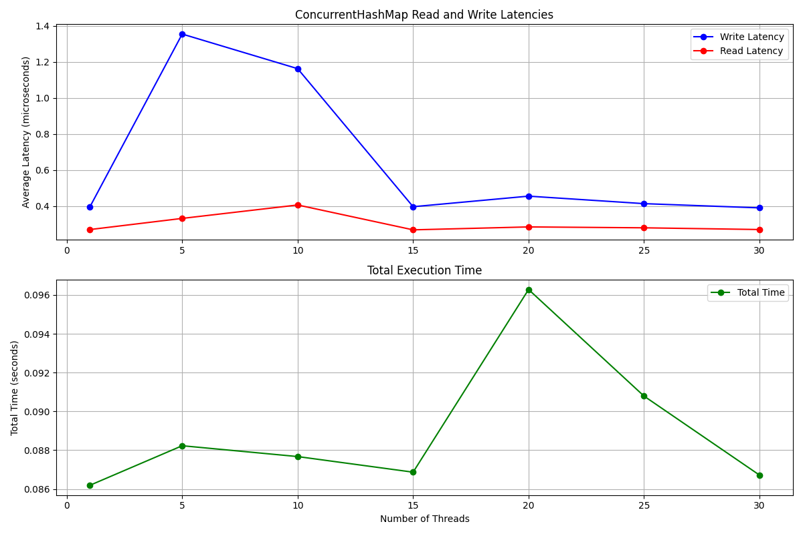

# Concurrent Hash Map

## Overview

The `ConcurrentHashMap` is a thread-safe implementation of a hash map in Python. It allows multiple threads to perform read and write operations on different buckets concurrently, ensuring efficient handling of data while avoiding race conditions. This project utilizes a fine-grained locking mechanism, where each bucket has its own lock, allowing for parallelism in operations.

## Features

- **Thread Safety**: Ensures safe concurrent access with the use of locks.
- **Scalable**: Uses fine-grained locks, meaning that only the bucket corresponding to a key is locked during operations, allowing for parallelism.
- **Basic Operations**: Supports typical hash map operations such as `put`, `get`, `contains_key`, `remove`, `clear`, `key_set`, `values` and checking the size with `__len__`.


### Benchmarks


## Usage

### Initialization
You can initialize the `ConcurrentHashMap` with a specific capacity (number of buckets). If no capacity is provided, the default value is 20.

```python
from concurrent_hash_map import ConcurrentHashMap

# Initialize the map with default capacity
concurrent_map = ConcurrentHashMap()

# Or initialize with a custom capacity
concurrent_map = ConcurrentHashMap(capacity=50) 
```

### Installation
To use this project, simply clone the repository:

```bash
git clone https://github.com/gtinside/py-concurrent-hashmap.git
cd py-concurrent-hashmap
```

### Testing
Run the following command to execute test cases
```bash
python -m unittest test/test_concurrent_hash_map.py
```

### Running benchmarks

```bash
python3 benchmark_threads.py 
```
Output on macOS

```bash
Threads: 1, Total time: 0.086497 s, Avg write: 0.000000395 s, Avg read: 0.000000268 s
Threads: 5, Total time: 0.087942 s, Avg write: 0.000001239 s, Avg read: 0.000001286 s
Threads: 10, Total time: 0.086512 s, Avg write: 0.000000887 s, Avg read: 0.000000551 s
Threads: 15, Total time: 0.086549 s, Avg write: 0.000000395 s, Avg read: 0.000000267 s
Threads: 20, Total time: 0.086110 s, Avg write: 0.000000388 s, Avg read: 0.000000267 s
Threads: 25, Total time: 0.086608 s, Avg write: 0.000000392 s, Avg read: 0.000000267 s
Threads: 30, Total time: 0.086624 s, Avg write: 0.000000392 s, Avg read: 0.000000267 s
```